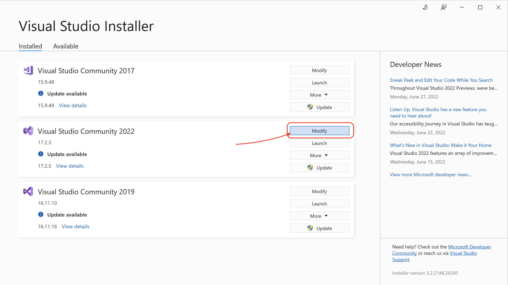
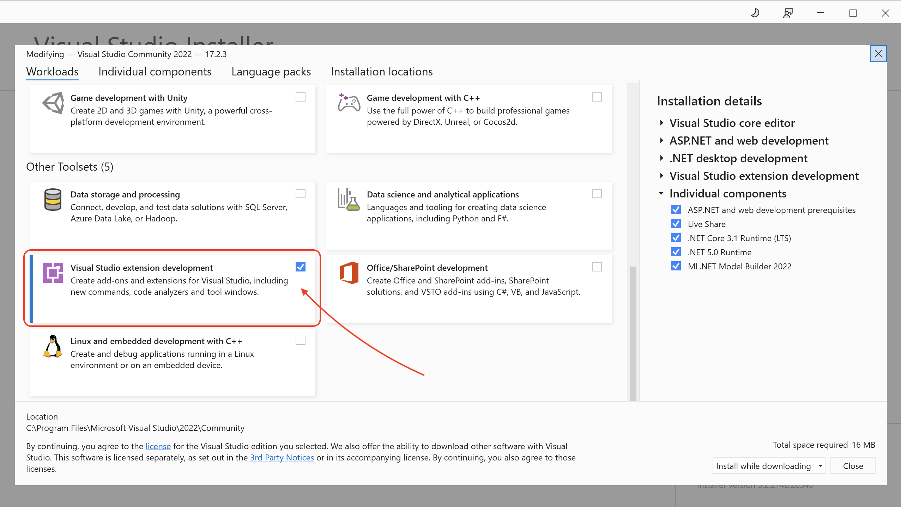
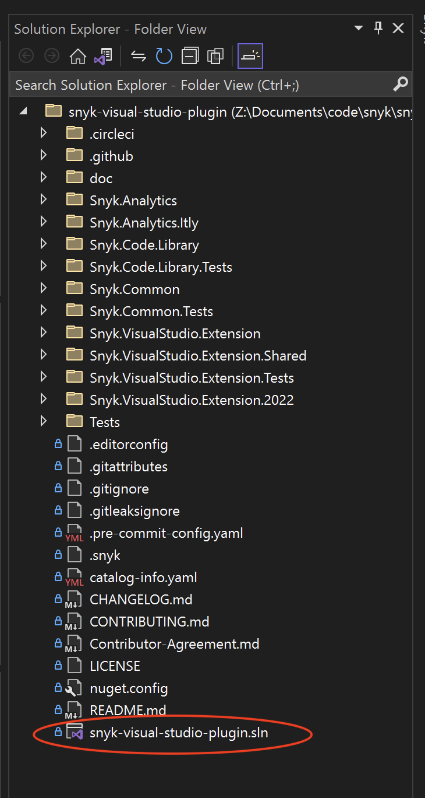
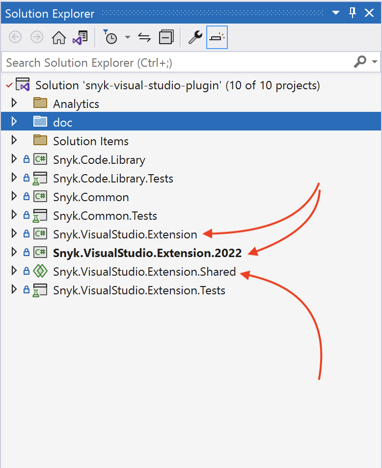
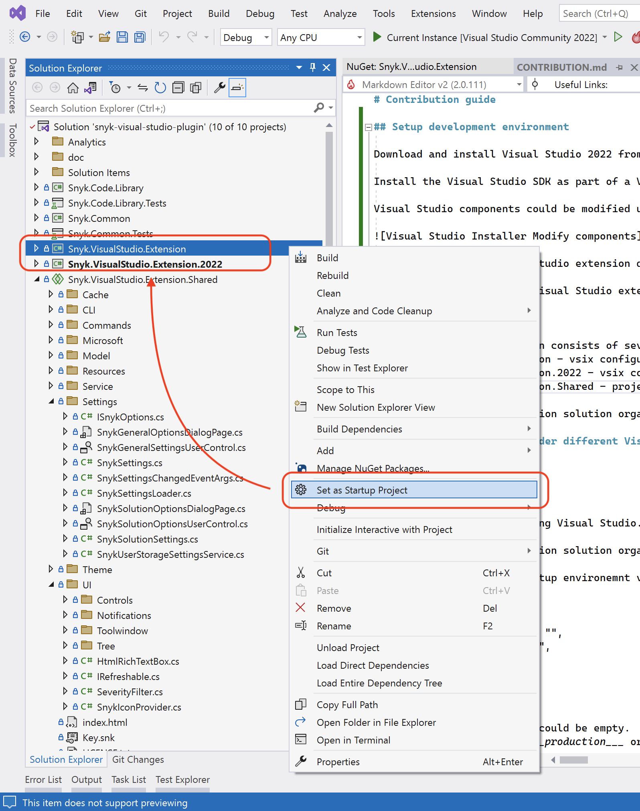
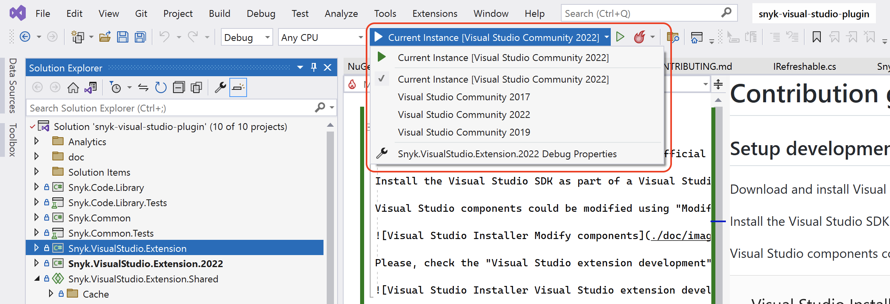
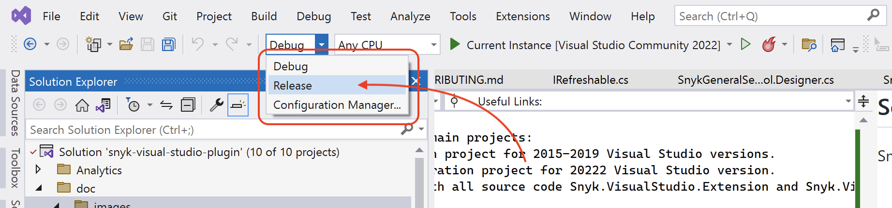

# Contribution guide

## Setup development environment

Download and install Visual Studio 2022 from [official website](https://visualstudio.microsoft.com/vs/).

Install the Visual Studio SDK as part of a Visual Studio installation. For details, please, see [this page](https://docs.microsoft.com/en-us/visualstudio/extensibility/installing-the-visual-studio-sdk?view=vs-2022).

Visual Studio components could be modified using "Modify" button.



Please, check the "Visual Studio extension development" checkbox to install extensions SDK.



## Execute snyk-visual-studio-plugin

Double click on `snyk-visual-studio-plugin.sln` 

## Solution organization

Snyk Visual Studio extension consists of several main projects:
- Snyk.VisualStudio.Extension - vsix configuration project for 2015-2019 Visual Studio versions.
- Snyk.VisualStudio.Extension.2022 - vsix configuration project for 20222 Visual Studio version.
- Snyk.VisualStudio.Extension.Shared - project with all source code Snyk.VisualStudio.Extension and Snyk.VisualStudio.Extension.2022 reference to this project.



### Debug Snyk extension under different Visual Studio versions.

To run Snyk extension under 2017-2019 Visual Studio versions you need to set ___Snyk.VisualStudio.Extension___ as startup project.



And select needed Visual Studio version.



## Release process

### Manual

You can build a release using Visual Studio.



In this case you need to setup environemnt variables for ___Snyk.Common/appsettings.json___ file or modify it manually

```
{
"SegmentAnalyticsWriteKey": "",
"SnykCodeApiEndpointUrl": "",
"SentryDsn": "",
"Environment": ""
}
```

- SnykCodeApiEndpointUrl - could be empty.
- Environment - could be ___production___ or ___development___

### GitHub actions

You can build a release using GitHub. For this, please, use [this action](https://github.com/snyk/snyk-visual-studio-plugin/actions/workflows/release.yml).

## Known issues

1. Visual Studio extension use XAML for UI development, but Visual Studio Settings use WinForms for UI.
2. WinForms designer not work in Shared projects (this is known Visual Studio limitation). If you need to modify WinForms controls (Settings controls) you could do it manually or move this files to other project, modify and move it back.

3. To support lowest version of Visual Studio (right now it's 2015) we use lowest versions of some important libraries. For example, Community.VisualStudio.Toolkit.14.

## Useful Links:
- [Start developing extensions in Visual Studio](https://docs.microsoft.com/en-us/visualstudio/extensibility/starting-to-develop-visual-studio-extensions?view=vs-2022)
- [Chat for Visual Studio extension developers](https://gitter.im/Microsoft/extendvs)
- [Visual Studio Extensions GitHub](https://github.com/Microsoft/extendvs)
- [Visual Studio Extensibility Checklist](https://gist.github.com/madskristensen/7310c0d61694e323f4deeb5a70f35fec)
- [Visual Studio User Experience Guidelines](https://docs.microsoft.com/en-us/visualstudio/extensibility/ux-guidelines/visual-studio-user-experience-guidelines?view=vs-2022)
- [Writing Visual Studio Extensions with Mads](https://www.youtube.com/watch?v=tU5ayB6jdK8&t=2s)
