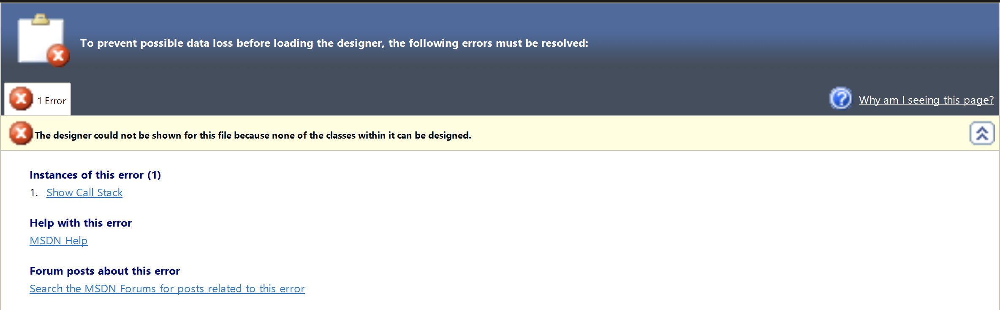

# Contributing to the Snyk IDE Extensions

We welcome contributions, but please read first! To ensure a smooth process and that your valuable work aligns with our roadmap, please keep the following in mind to help manage expectations:

## 1. Planning your changes

Before undertaking any changes or new features, please discuss your plans with us. This helps align on scope, design, technical approach, and priority.  
Even bug fixes can have unforeseen impacts or alternative solutions better suited for the codebase, so please ask first, we will be happy to discuss.  
Please raise a request with [support](https://support.snyk.io). (Snyk employees, use `#ask-ide`)

## 2. Where changes should be made

Consider whether your proposed change should be implemented within the IDE extension(s) or in the shared Language Server and related stack.
- [Snyk Language Server](https://github.com/snyk/snyk-ls)
- [Go Application Framework](https://github.com/snyk/go-application-framework)
- [Code Client Go](https://github.com/snyk/code-client-go)

## 3. Cross-IDE consistency

If your change is applicable to other Snyk IDE plugins as well, we may expect you to submit similar PRs for the other relevant IDE repositories after your initial PR has been reviewed and approved, as they will _usually_ need to be merged all at once or not at all.
- [Snyk VSCode extension](https://github.com/snyk/vscode-extension)
- [Snyk IntelliJ plugin](https://github.com/snyk/snyk-intellij-plugin)
- [Snyk Eclipse plugin](https://github.com/snyk/snyk-eclipse-plugin)

## 4. Manual testing

All changes must be thoroughly manually tested by you.  
For visual changes the PR template asks for screenshots, so this is a good opportunity to snap them.

## 5. Documentation changes

Any user-facing changes will require [documentation](https://docs.snyk.io/) changes, which you will need to prepare.
If you do not have access to our content management system (you are not a Snyk employee), please add the documentation changes required (including new wording and screenshots) to the PR description.

We can instruct you on what to add to the CHANGELOG.md, so please ask.

---

# Making changes

## Setup development environment

Download and install Visual Studio 2022 from [official website](https://visualstudio.microsoft.com/vs/).

Install the Visual Studio SDK as part of a Visual Studio installation. For details, please, see [this page](https://docs.microsoft.com/en-us/visualstudio/extensibility/installing-the-visual-studio-sdk?view=vs-2022).

Visual Studio components could be modified using "Modify" button.


Please, check the "Visual Studio extension development" checkbox to install extensions SDK.


## Execute snyk-visual-studio-plugin

Double click on `snyk-visual-studio-plugin.sln` 

## Solution organization

Snyk Visual Studio extension consists of several main projects:
- Snyk.VisualStudio.Extension - vsix configuration project for 2015-2019 Visual Studio versions.
- Snyk.VisualStudio.Extension.2022 - vsix configuration project for 20222 Visual Studio version.
- Snyk.VisualStudio.Extension.Shared - project with all source code Snyk.VisualStudio.Extension and Snyk.VisualStudio.Extension.2022 reference to this project.


### Debug Snyk extension under different Visual Studio versions.

To run Snyk extension under 2017-2019 Visual Studio versions you need to set ___Snyk.VisualStudio.Extension___ as startup project.


And select needed Visual Studio version.


## Release process

### Manual

You can build a release using Visual Studio.


In this case you need to setup environemnt variables for ___Snyk.Common/appsettings.json___ file or modify it manually

```
{
"SegmentAnalyticsWriteKey": "",
"SnykCodeApiEndpointUrl": "",
"SentryDsn": "",
"Environment": ""
}
```

- SnykCodeApiEndpointUrl - could be empty.
- Environment - could be ___production___ or ___development___

### GitHub actions

You can build a release using GitHub. For this, please, use [this action](https://github.com/snyk/snyk-visual-studio-plugin/actions/workflows/release.yml).

## Known issues

1. Visual Studio extension use XAML for UI development, but Visual Studio Settings use WinForms for UI.
2. WinForms designer not work in Shared projects (this is known Visual Studio limitation). If you need to modify WinForms controls (Settings controls) you could do it manually or move this files to other project, modify and move it back.

3. To support lowest version of Visual Studio (right now it's 2015) we use lowest versions of some important libraries. For example, Community.VisualStudio.Toolkit.14.

## Useful Links:
- [Start developing extensions in Visual Studio](https://docs.microsoft.com/en-us/visualstudio/extensibility/starting-to-develop-visual-studio-extensions?view=vs-2022)
- [Chat for Visual Studio extension developers](https://gitter.im/Microsoft/extendvs)
- [Visual Studio Extensions GitHub](https://github.com/Microsoft/extendvs)
- [Visual Studio Extensibility Checklist](https://gist.github.com/madskristensen/7310c0d61694e323f4deeb5a70f35fec)
- [Visual Studio User Experience Guidelines](https://docs.microsoft.com/en-us/visualstudio/extensibility/ux-guidelines/visual-studio-user-experience-guidelines?view=vs-2022)
- [Writing Visual Studio Extensions with Mads](https://www.youtube.com/watch?v=tU5ayB6jdK8&t=2s)
